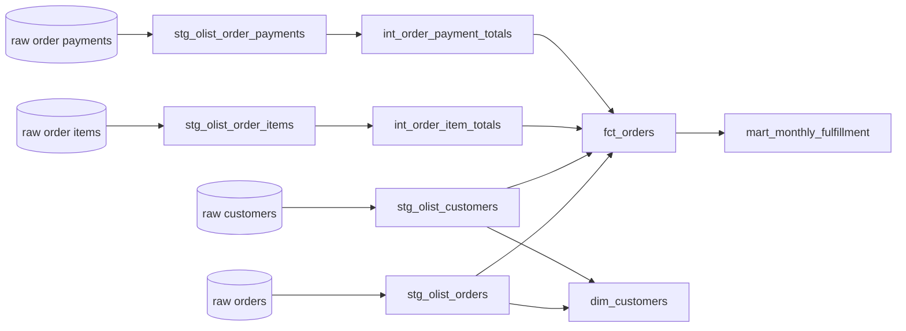

# Marketplace Analytics with dbt

A dbt Core project on Snowflake that models marketplace orders, payments, and fulfillment from the public Olist e-commerce dataset. It covers 99,441 orders with nine models, 51 data tests, and 3 unit tests. 

## Business Questions

1. How many orders were placed and delivered each purchase month? 
2. What are the merchandise value, freight, and recorded payment values associated with those orders?
3. Which orders differ between item-plus-freight totals and recorded payments?
4. What percentage of eligible delivered orders arrived on time? 
5. How do these measures vary by customer state?

## Stack

Snowflake (X-Small warehouse), dbt Core 1.12.5 with dbt-snowflake 1.12.1, SQL, Python 3.12

## Models

| Layer | Model | Grain | Materialization |
|---|---|---|---|
| Staging | `stg_olist_orders` | One order | View |
| Staging | `stg_olist_order_items` | One order item | View |
| Staging | `stg_olist_order_payments` | One payment record | View |
| Staging | `stg_olist_customers` | One order-associated customer record | View |
| Intermediate | `int_order_item_totals` | One order with items | View |
| Intermediate | `int_order_payment_totals` | One order with payments | View |
| Marts | `dim_customers` | One repeat customer | Table |
| Marts | `fct_orders` | One source order | Table |
| Marts | `mart_monthly_fulfillment` | Purchase month by customer state | Table |

## Lineage



Items and payments are each aggregated to one row per order before they are joined. Joining them directly multiplies rows and inflates both totals while the difference between them stays at zero. The same graph, with column-level documentation, is available by running `dbt docs generate` and `dbt docs serve`. 

## Repository layout 

| Path | Contents | 
|---|---|
| `sql/setup/` | Snowflake object creation and raw loading scripts | 
| `sql/validation/` | Independent checks run directly in Snowflake | 
| `marketplace_analytics/` | The dbt project (models, tests, analyses) | 
| `docs/` | Metric definitions, design decisions, debugging note | 

## Setup 

Prerequisites: a Snowflake account, Python 3.12, and Git

1. **Obtaining the data.** Download the dataset from Kaggle (link under Dataset). Four files are used: orders, order items, order payments, and customers. 
2. **Create the Snowflake objects.** Run `sql/setup/01_snowflake_foundation.sql`. 
3. **Load the raw tables.** Follow `sql/setup/02_raw_load.sql`. It creates the file format, stage, and four text-typed tables, and includes the upload step. 
4. **Install dbt** from the repository root: 

```powershell
    python -m venv .venv
    .venv\Scripts\Activate.ps1
    python -m pip install -r requirements.txt
```

5. **Create a profile.** Copy `marketplace_analytics/profiles.example.yml` to `~/.dbt/profiles.yml` and fill in your own account values. Do not commit the real profile. 
6. **Build** from the `marketplace_analytics` folder: 

```powershell
    dbt debug
    dbt build
```

Expected result: `PASS=63 WARN=0 ERROR=0 SKIP=0 TOTAL=63` (9 models, 51 data tests, 3 unit tests). 

## Useful commands 

| Command | Purpose |
|---|---|
| `dbt build` | Build all models and run all tests | 
| `dbt test --select "test_type:unit"` | Run the known-answer fixture only | 
| `dbt test --select "test_type:singular"` | Run the custom SQL tests only |
| `dbt compile` | Write runnable SQL for the analyses to `target/compiled` | 
| `dbt docs generate` then `dbt docs serve` | Browse documentation and lineage | 
| `dbt build --target rebuild` | Rebuild everything into an empty schema |

## Tests and validation
| Type | Count | Covers |
|---|---:|---|
| Generic data tests | 46 | Keys, relationships, accepted values, required columns |
| Singular (custom SQL) data tests | 5 | Order coverage, reconciliation to raw sources, mart consistency, on-time metric rules, non-negative money |
| Unit tests | 3 | Known-answer fixture on synthetic rows |
| Validation scripts | 5 | Independent checks in `sql/validation/` |

- **Independent reconciliation.** Fact and mart totals equal the raw totals exactly. A raw-only query reproduces the 303 payment exceptions without using any dbt model.
- **Known-answer fixture.** One order with two items and two payments must total 35 on both sides. A direct join would produce 70.
- **Defect exercise.** A join fanout was introduced on a branch, caught by the unit test and the source reconciliation test, and reverted. See `docs/debugging_notes.md`. 
- **Fresh-schema rebuild.** The full project was rebuilt into an empty schema from the raw tables. Key figures matched the development schema (`sql/validation/07_fresh_schema_rebuild_checks.sql`). 

## Results

| Measure | Value |
|---|---:|
| Orders | 99,441 |
| Delivered orders | 96,470 |
| On-time orders | 89,936 (93.2% of delivered) |
| Payment exceptions | 303 (largest difference 182.81) |
| Recorded merchandise value | 13,591,643.70 |
| Recorded freight | 2,251,909.54 |
| Recorded payments | 16,008,872.12 |
| Repeat-customer records | 96,096 |
| Mart rows (month by state) | 565 across 25 months and 27 states |

On-time rates for the three largest states by delivered orders are 0.9551 (SP), 0.8789 (RJ), and 0.9543 (MG). State rates range from 0.7859 to 0.9724.

Values are recorded marketplace values in the source currency. They are not company revenue. 

## Documentation

- `docs/metric_definitions.md`: each metric with its rule, numerator, denominator, and verified value
- `docs/design_decisions.md`: modeling choices, testing approach, limitations
- `docs/debugging_notes.md`: the fanout defect exercise

## Limitations

- The first and last purchase months have 4 orders each, so their rates are not comparable to full months
- One calendar month in the range has no orders: 2016-11
- Low-volume states and months can show extreme rates. Each rate is stored with its denominator
- Months are purchase-month cohorts, not a live operational view
- The source time zone is not stated

## Not included

No CI pipeline, scheduled runs, incremental models, freshness checks, snapshots, semantic layer, or dashboard. The project loads a fixed historical extract once. 

## Dataset

[Braziian E-Commerce Public Dataset](https://www.kaggle.com/datasets/olistbr/brazilian-ecommerce) by Olist, published on Kaggle.
